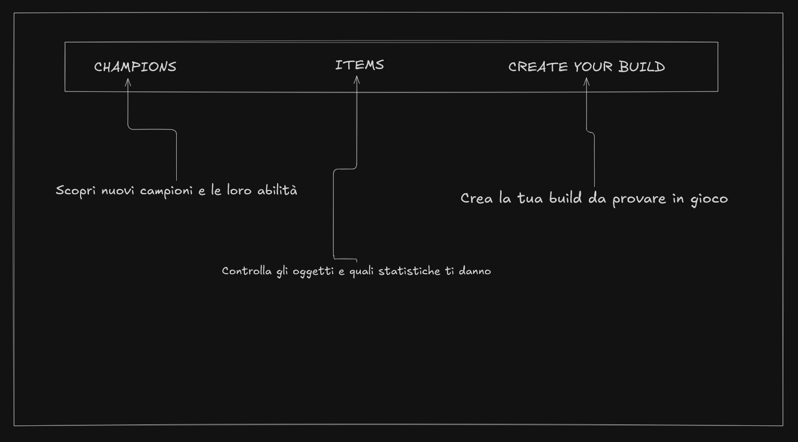
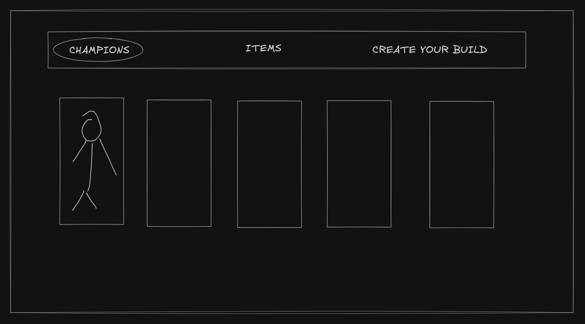
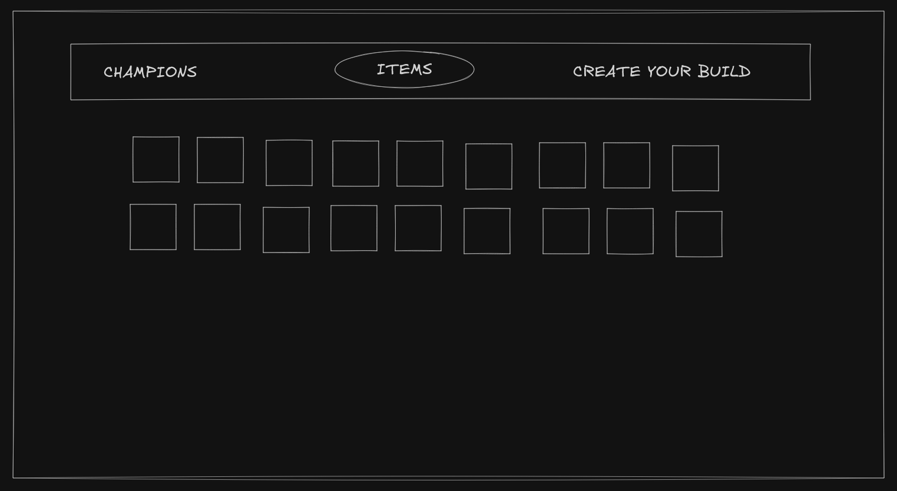

# League Configurator - [Link](https://league-configurator.vercel.app)

Voglio una piattaforma in cui poter trovare tutte le informazioni che mi servono su League of Legends, accedere alle abilità dei campioni e alle statistiche degli oggetti in modo facile e poter provare la mia build prima della prossima partita.

Features:
- Ricerca di campioni per nome, ruolo
- Ricerca di item per nome, categoria, statistiche
- Build configurator
  - 6 items
  - Restrizione sui gruppi di item non compatibili
  - salvataggio di fino a 3 build in LocalStorage 

## Wireframe

Home Page


Champions Page


Items Page


Builds Page


## Tech stack
**Framework**: NextJS + Typescript

**Styling**: Tailwind

**API**: DataDragon (Riot)

**Storage**: Local Storage

---
- Server components usati per effettuare le chiamate api 
- Client components per renderizzare componenti che richiedono interattività
- route di campioni e items generate staticamente con useStaticParams
---

## Struttura delle pagine
```
/
├─ app/
│  ├─ page.tsx                # Home
│  │
│  ├─ champions/
│  │  ├─ page.tsx
│  │  └─ [cahmpionId]/
│  │     └─ page.tsx
│  │
│  ├─ items/
│  │  ├─ page.tsx
│  │  └─ [id]/
│  │     └─ page.tsx
│  │
│  ├─ builds/
│  │  └─ page.tsx
│  │
│  ├─ layout.tsx
│  └─ globals.css
│
├─ lib/
│  ├─ api/
│  │  └─ datadragon.ts
│  └─ const/
│     └─ const.ts
│
├─ hooks/
│  └─ useLocalStorage.ts
│
├─ components/
│  ├─ buildConfigurator.tsx
│  └─ ...
│
└─ types/
   └─ datadragon.ts
```